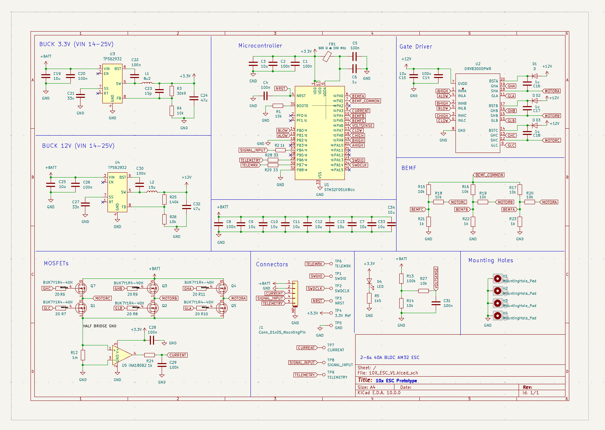
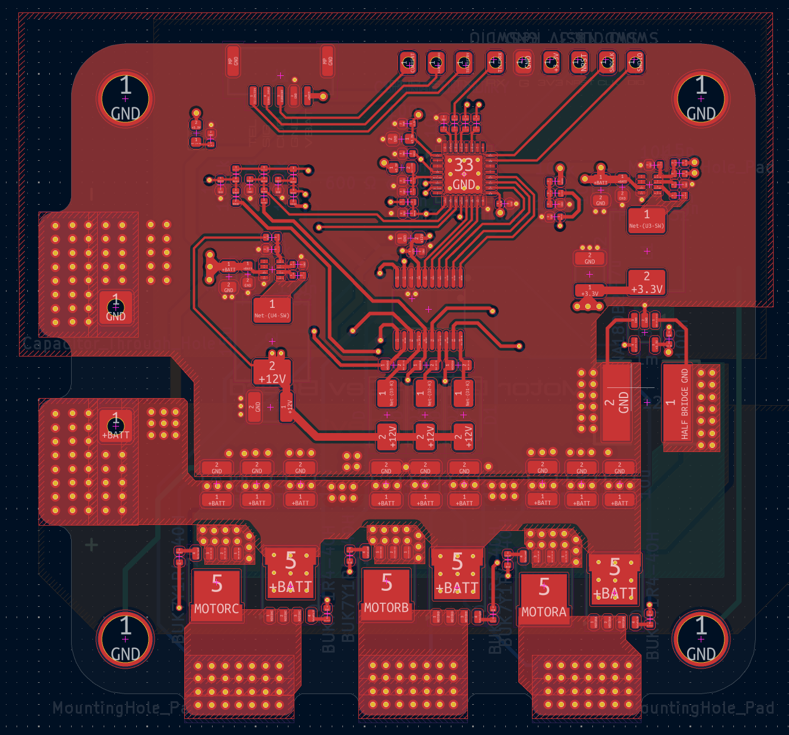
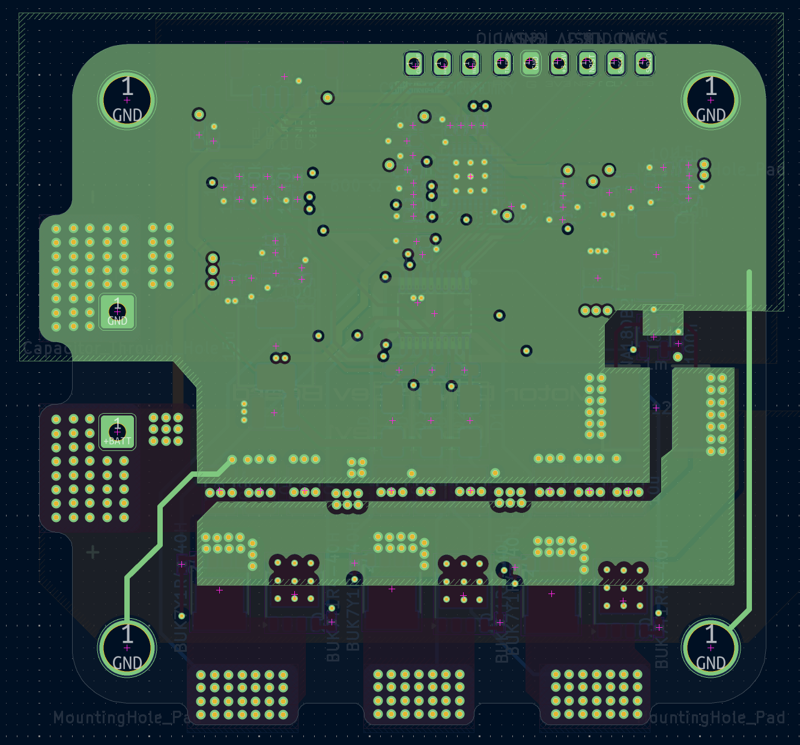
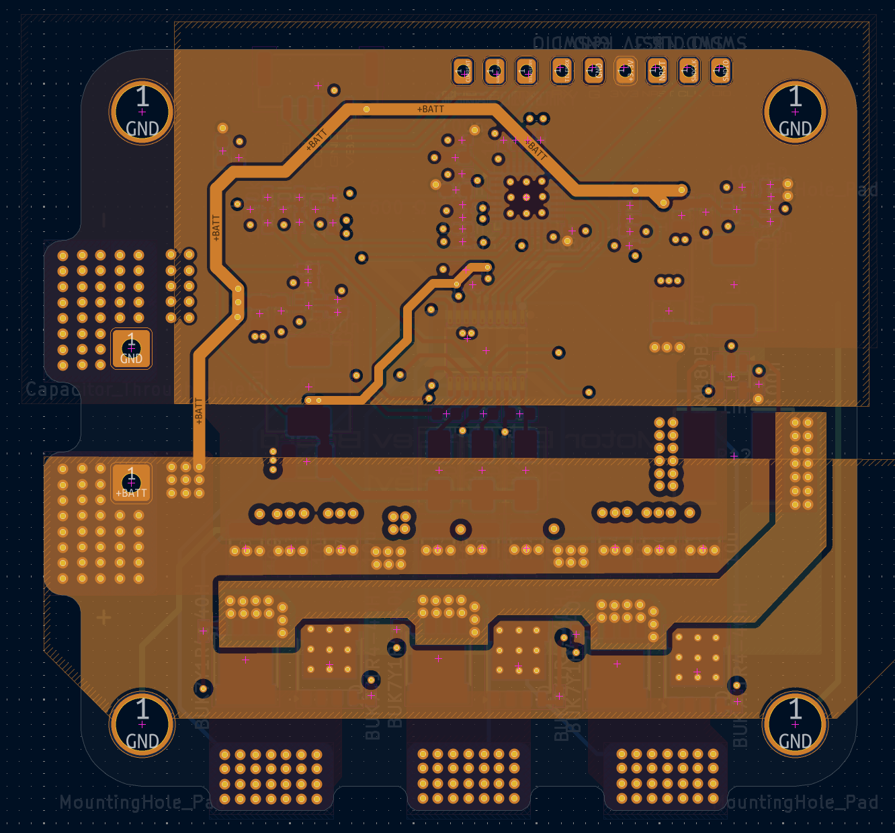
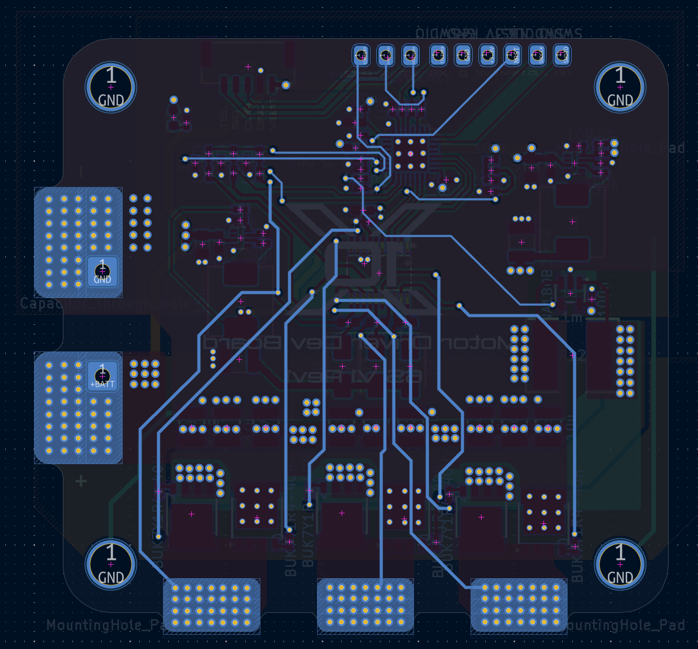
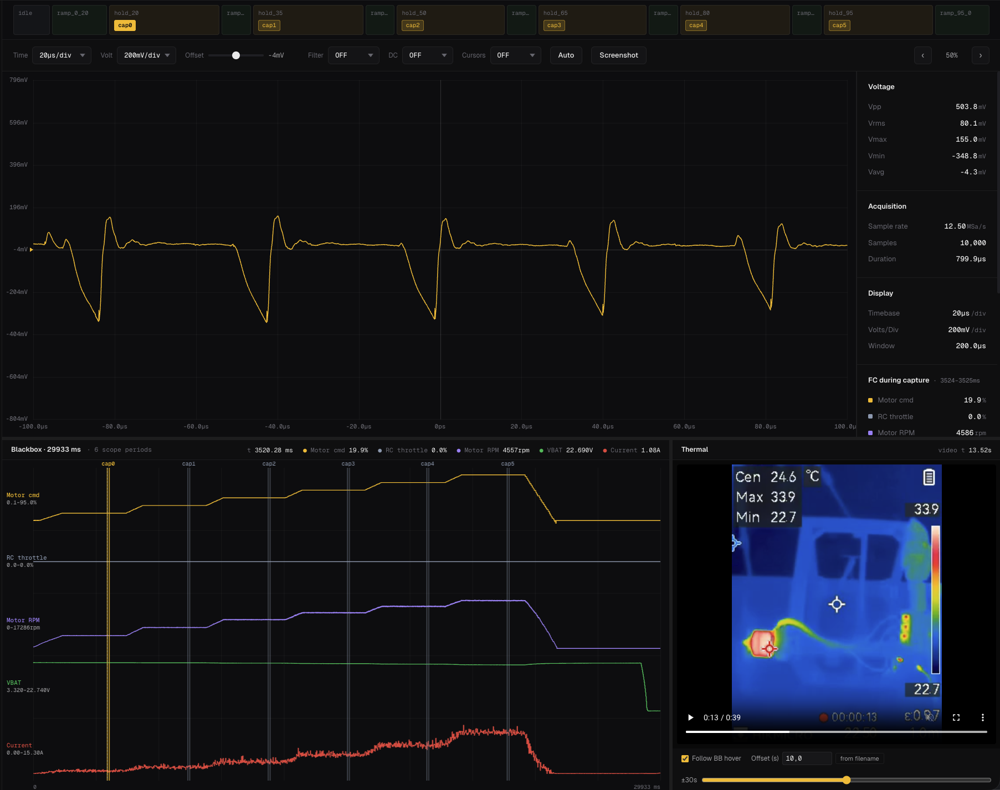
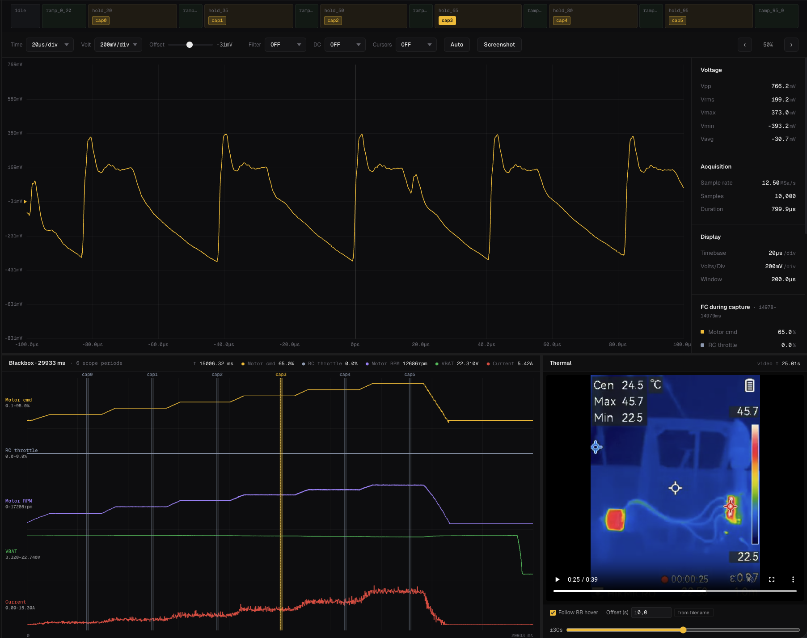
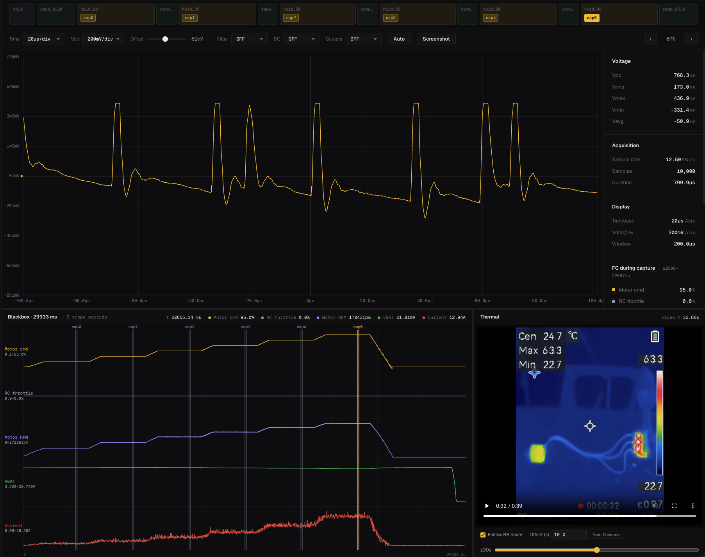

https://github.com/user-attachments/assets/5f652ef7-dc9c-4700-bebd-08a81333550c

# ESC Development Board

A 6S AM32-compatible ESC built as a proof of concept for learning how to design an ESC from scratch. It gets a motor spinning — that's about the extent of what's guaranteed. Beyond that, expect rough edges.

The design is sloppy in places. If you spot schematic, layout, or component choices that actively work against basic ESC functionality, open an issue.

## Hardware

- **MCU:** STM32F051
- **Firmware:** AM32
- **Max cells:** 6S

  
  

### Schematic

### PCB layers

  
  

  
  

## Testing

### Setup

- **Motor:** AOS Supernova 3220 925KV
- **Battery:** 6S LiPo
- **Prop:** 7×7
- **Bulk cap:** 1000 µF
- **Measurement:** AC-coupled VBAT ripple, probed directly at the battery solder pads

### Throttle sequence

| t (s) | Action         | Throttle | Duration |
| ----- | -------------- | -------- | -------- |
| 0.0   | Idle           | —        | 1.0 s    |
| 1.0   | Ramp           | 0 → 20%  | 1.5 s    |
| 2.5   | Hold (capture) | 20%      | 2.0 s    |
| 4.5   | Ramp           | 20 → 35% | 0.8 s    |
| 5.3   | Hold (capture) | 35%      | 2.0 s    |
| 7.3   | Ramp           | 35 → 50% | 0.8 s    |
| 8.1   | Hold (capture) | 50%      | 2.0 s    |
| 10.1  | Ramp           | 50 → 65% | 0.8 s    |
| 10.9  | Hold (capture) | 65%      | 2.0 s    |
| 12.9  | Ramp           | 65 → 80% | 0.8 s    |
| 13.7  | Hold (capture) | 80%      | 2.0 s    |
| 15.7  | Ramp           | 80 → 95% | 0.8 s    |
| 16.5  | Hold (capture) | 95%      | 2.0 s    |
| 18.5  | Ramp down      | 95 → 0%  | 1.5 s    |
| 20.0  | End            | —        | —        |

### Results

https://github.com/user-attachments/assets/3ce99b9d-343a-43b4-ace9-065e4792fe87

## Known mistakes

- The DRV8300DPWR has internal bootstrap diodes, so the external bootstrap diodes on this design are redundant. Doesn't break anything — just unnecessary parts cost and board area.

## Flashing AM32 on a custom ESC

General workflow for getting AM32 running on any custom STM32-based ESC, not just this one. Two things to figure out for your own board: which AM32 target matches your pin layout, and how to physically flash it.

### Figuring out the pin config

AM32 organizes pin assignments in two layers:

- **Hardware groups** define the low-level pins — signal input, the six phase outputs (three high-side PWM + three low-side COM), BEMF feedback pins, and the comparator reference. Grouped per MCU family (`F0_A`, `F0_B`, etc.) and listed in the [AM32 Supported Hardware wiki](https://github.com/AlkaMotors/AM32-MultiRotor-ESC-firmware/wiki/List-of-Supported-Hardware).
- **Targets** sit on top of a hardware group and add ADC pins for voltage and current sensing, plus anything board-specific like LED pins. Target definitions live in `Inc/targets.h` in the [am32-firmware/AM32 repo](https://github.com/am32-firmware/AM32) as `#ifdef` blocks.

Compare your schematic against the hardware group table. If one matches your phase outputs, BEMF pins, and signal input exactly, use it and write a target that points to your ADC pins. If nothing matches, you'll need to define a new hardware group — that means editing the MCU-level source, not just a target header.

Match your signal input pin carefully. The bootloader `.hex` filename encodes which pin it expects (e.g. `..._PB4_V17.hex` expects the signal on PB4). Mismatches mean the ESC won't respond to the configurator.

### Flashing the bootloader

SWD only — the bootloader has to go on over ST-Link. Wire SWDIO, SWCLK, and GND from the ST-Link to the SWD pads on the ESC, and power the ESC from a LiPo.

1. Install [ST-LINK Utility](https://www.st.com/en/development-tools/stsw-link004.html).
2. Grab the correct bootloader from [am32.ca/downloads](https://am32.ca/downloads).
3. Flash the `.hex` to `0x08000000`.

### Flashing the firmware

Once the bootloader is on, the main firmware goes over the signal wire via FC passthrough — no more SWD needed.

1. Connect the ESC's signal and GND to a flight controller motor output, and plug the FC into your PC via USB.
2. Install the [AM32 Offline Configurator](https://github.com/am32-firmware/Offline-Configurator/releases).
3. Download the firmware `.hex` matching your target from the [AM32 releases](https://github.com/am32-firmware/AM32/releases).
4. Open the configurator, connect to the FC's serial port, and flash the `.hex`.

The FC needs to be running a DShot protocol (300 or 600) for passthrough to work, and the ESC needs battery power — USB alone won't boot it.
